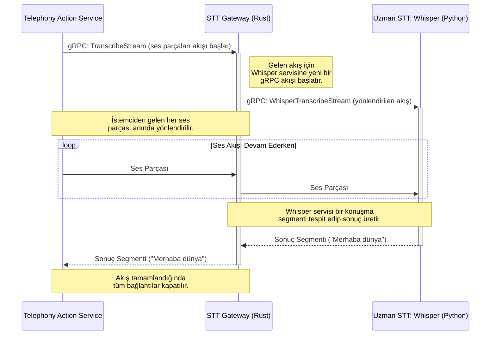

# 👂 Sentiric STT Gateway Service - Mantık ve Akış Mimarisi

**Stratejik Rol:** Konuşma Tanıma (STT) isteklerini (dosya veya canlı akış) alır ve isteğin türüne, diline veya performans ihtiyacına göre en uygun uzman STT motoruna (`stt-whisper-service`, `stt-google-service` vb.) yönlendirir. Bu servis, platformun STT yetenekleri için tek bir giriş noktasıdır.

---

## 1. Uçtan Uca Akış (Streaming Senaryosu)

Gateway'in en kritik rolü, canlı ses akışlarını yönetmektir. `telephony-action-service`'ten gelen bir `TranscribeStream` isteğinin izlediği yol aşağıda gösterilmiştir.

## 2. Temel Sorumluluklar

*   **Protokol Köprüsü:** Gateway, farklı protokollerle konuşabilen uzman motorları tek bir standart gRPC arayüzü arkasında soyutlar.
*   **Şeffaf Proxy:** Başlangıç aşamasında (Faz 1), gateway gelen istekleri doğrudan `stt-whisper-service`'e ileten basit bir "şeffaf proxy" görevi görür.
*   **Akıllı Yönlendirici (Gelecek):** Gelecekte, isteğin içindeki `model_selector` veya `tenant` yapılandırmasına göre farklı uzman motorlara (örn: Google STT) yönlendirme yapacak zekaya sahip olacaktır.

---
