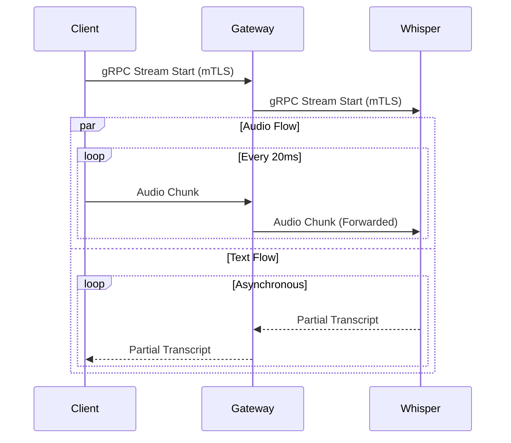

# 🧠 Akış Mantığı (Streaming Logic)

Bu servis, Rust'ın `Tokio` asenkron çalışma zamanı ve `Tonic` gRPC kütüphanesini kullanarak yüksek performanslı bir "Streaming Proxy" görevi görür.

## Veri Akış Diyagramı

## Stream Dönüşümü (Mapping)

Gateway, iki farklı proto mesajı arasında çeviri yapar:
*   **Girdi:** `TranscribeStreamRequest` -> `WhisperTranscribeStreamRequest`
*   **Çıktı:** `WhisperTranscribeStreamResponse` -> `TranscribeStreamResponse`

Bu işlem `src/grpc/server.rs` dosyasında `filter_map` ve `map` fonksiyonları ile reaktif (reactive) olarak yapılır.
