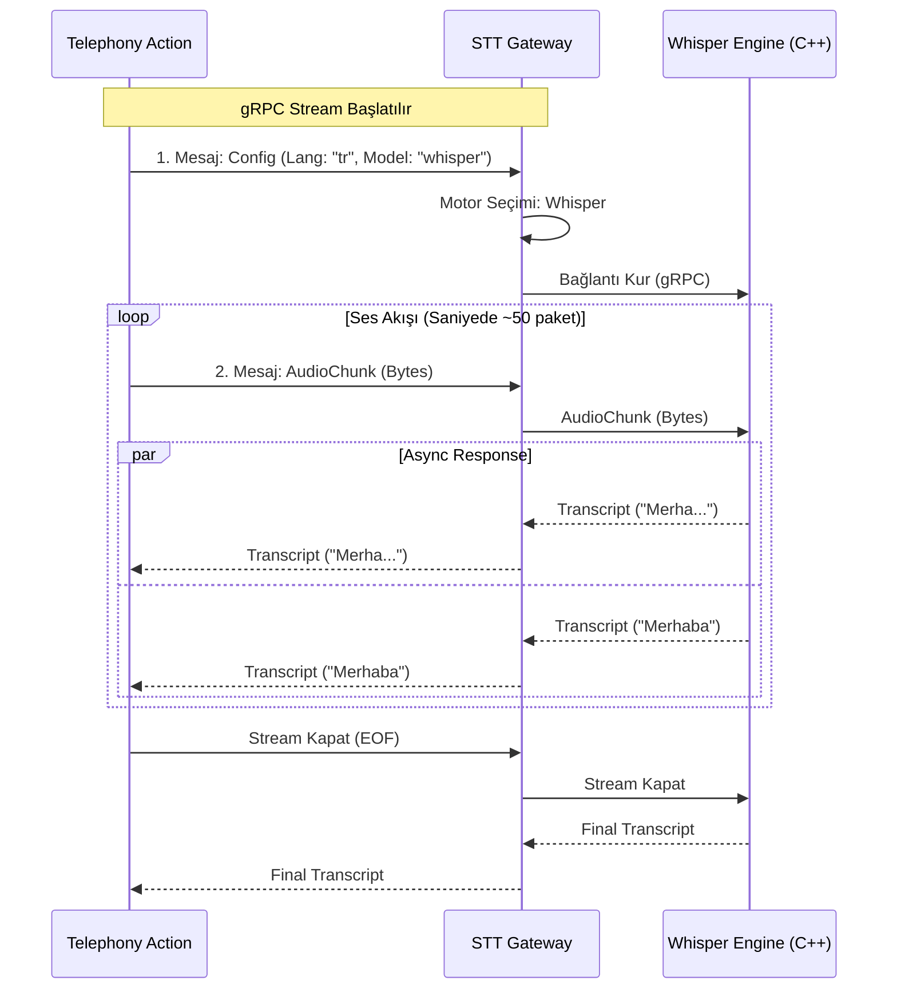

# 🧠 Mantık ve Akış Mimarisi

Bu belge, `stt-gateway-service`in canlı ses akışlarını nasıl yönettiğini ve motor seçimini nasıl yaptığını açıklar.

## 1. Yönlendirme Tablosu (Routing Logic)

Gateway, gRPC akışının **ilk mesajında** gelen `StreamingConfig` içindeki `model_preference` alanına bakar.

| Tercih (Preference) | Hedef Servis | URL (Env Değişkeni) | Protokol |
| :--- | :--- | :--- | :--- |
| `whisper` (Varsayılan) | **Whisper C++** | `STT_WHISPER_SERVICE_GRPC_URL` | gRPC Stream |
| `google` | **Google STT** | `STT_GOOGLE_API_KEY` | REST/gRPC |
| `azure` | **Azure STT** | `STT_AZURE_KEY` | REST |

## 2. Akış Diyagramı (Stateful Streaming)

Bu servis "Stateless" değildir; bir akış süresince bağlantıyı açık tutar.

## 3. Hata Yönetimi

*   **Bağlantı Kopması:** Eğer Whisper servisi akış ortasında koparsa, Gateway istemciye `UNAVAILABLE` hatası dönmeli ve akışı güvenli bir şekilde kapatmalıdır.
*   **VAD (Sessizlik):** Gateway, sessizlik tespiti yapmaz; bunu motorlara (Whisper) veya istemciye (`telephony-action`) bırakır. Sadece veriyi taşır.