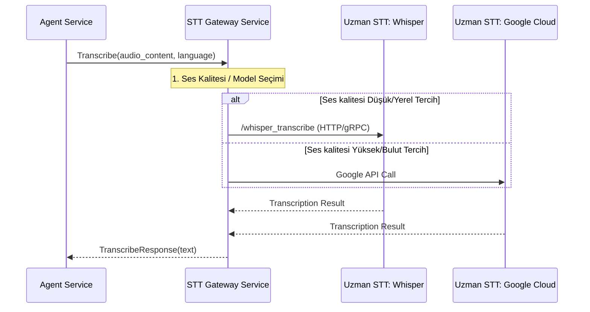

# 👂 Sentiric STT Gateway Service - Mantık ve Akış Mimarisi

**Stratejik Rol:** Konuşma Tanıma (STT) isteklerini (dosya veya canlı akış) alır ve isteğin türüne, diline veya performans ihtiyacına göre en uygun uzman STT motoruna (Whisper, Google) yönlendirir.

---

## 1. Akıllı Yönlendirme ve Protokol Dönüşümü

STT Gateway, gelen gRPC/HTTP isteklerini, uzman motorların beklediği API formatına çevirir (REST/gRPC).

```mermaid
sequenceDiagram
    participant Agent as Agent Service
    participant STTGateway as STT Gateway Service
    participant Whisper as Uzman STT: Whisper
    participant GoogleSTT as Uzman STT: Google Cloud
    
    Agent->>STTGateway: Transcribe(audio_content, language)
    
    Note over STTGateway: 1. Ses Kalitesi / Model Seçimi
    alt Ses kalitesi Düşük/Yerel Tercih
        STTGateway->>Whisper: /whisper_transcribe (HTTP/gRPC)
    else Ses kalitesi Yüksek/Bulut Tercih
        STTGateway->>GoogleSTT: Google API Call
    end
    
    Whisper-->>STTGateway: Transcription Result
    GoogleSTT-->>STTGateway: Transcription Result

    STTGateway-->>Agent: TranscribeResponse(text)
```

## 2. Streaming (Akış) Yönetimi
Bu servis, canlı telefon görüşmeleri gibi düşük gecikmeli senaryolarda TranscribeStream RPC'lerini veya WebSocket bağlantılarını da yönetecek ana noktadır.
* Gecikme (Latency) Önemli: Agent, STT Gateway'e canlı ses akışını iter. Gateway, bunu en hızlı uzman motora (örn: yerel modeller için özel olarak ayarlanmış Whisper) yönlendirir.